# 李宏毅机器学习

## 课程链接

1. 网课https://www.bilibili.com/video/BV1Wv411h7kN
2. 课件和资料Github汇总版：https://github.com/Fafa-DL/Lhy_Machine_Learning
3. 公众号【啥都会一点的研究生】课件资料：https://pan.baidu.com/s/1agZm-kXjF4aWH_4lRBv-Sg 

提取码：5b1w

## 基本概念

1. 机器学习就是找一个函数

      ex：图片辨识：f(含有猫的图片)=猫

2. 深度学习：这个函数是类神经网络

3. supervised learning：收集数据，做标记label；

​      self-supervised learning: pre-train 通过无标记数据 学基本功能

​      pre-trained model 预训练模型（bert）

​      downstream tasks 下游任务

​      generative adversarial network  生成对抗网络 （不用输入成对数据，自动找出x和y之间的关联）

​      reinforcement learning （RL）强化学习 （不知道怎么标注资料，但知道什么结果是成功）

​      anomaly detection 异常检测

​      explainable AI 可解释性ai（给出为什么这样判断的原因）

​      model attack  

​      domain adaptation

​      network compression

​      Meta learning 学习如何学习，自己创造方法（few-shot learning）

## 前置学习

  数学：微积分、线性代数、概率

  python 

  Google colab

 

## 第一节课

regression（输出是数值）

classification（分类，准备好选项，输出一个类别）

structured learning （产生有机构的东西）

### 机器学习找函数的过程

1. **写出含有未知参数的表达式 y=b+wx**  （w权重weight，b偏差bias，x特征feature）

2. **定义loss   L(b,w)**   

   在某组b，w下，计算预测的和实际的差值，判断这组参数好不好（MAE绝对值，MSE平方差）

3. **最佳化optimization   找使loss最小的一组b，w**

​       方法：gradient descent （梯度下降：一种一阶迭代优化算法，用于寻找可微函数的局部最小值）

​       微分：求导，求切线斜率（k为负增加w，k为正减小w） 

​       增加多少因素：（1）k较大w多增加，k较小少增加；（2）超参数hyperparameters（自己设定的）

​       局部最优解local minima，全局最优解global minima（类似于导数的极小值和最小值）

​       计算：     

​       （1）w从w0到w1的增量（w1-w0）=超参数x微分， 所以w1=w0-超参数x微分

​       （2）**双参数**，就分别求w对L的微分、b对L的微分（控制变量，求一个，另一个当常量）

### 模型局限

linear model  线性模型  model bias 模型局限（比如线性模型无法预测先增后减）

### Sigmoid function

#### 第一步 写出含有未知参数的表达式

all piecewise linear curves = constant + sum of a set of 某折线 _/

模拟（近似）连续曲线approximate continuous curve——>逼近

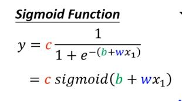

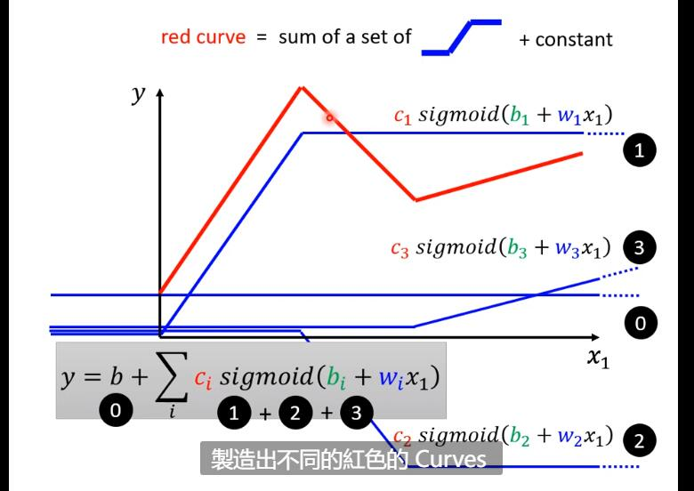

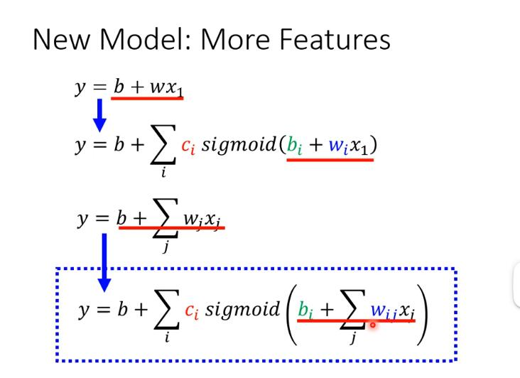

j表示特征，即x123  

i表示s型函数

r是括号里面算完的结果

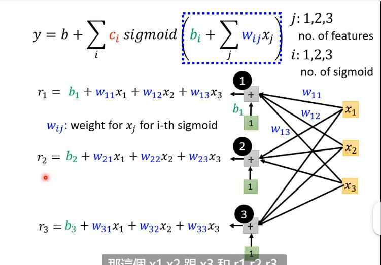

类比矩阵和向量的相乘

r是个向量，w是矩阵，x、b是向量

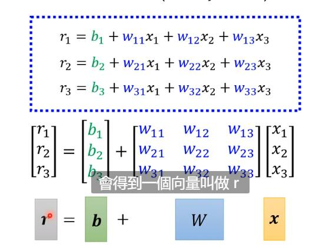

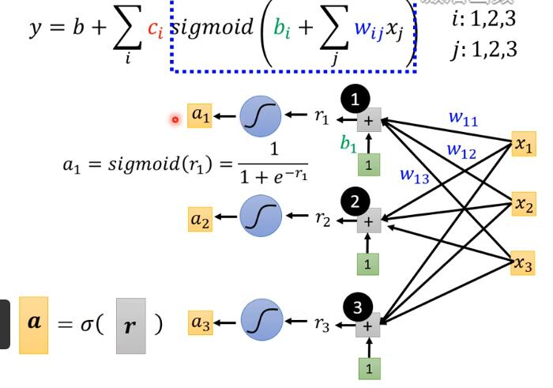

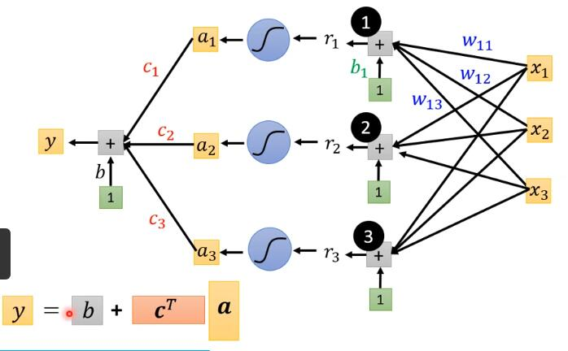

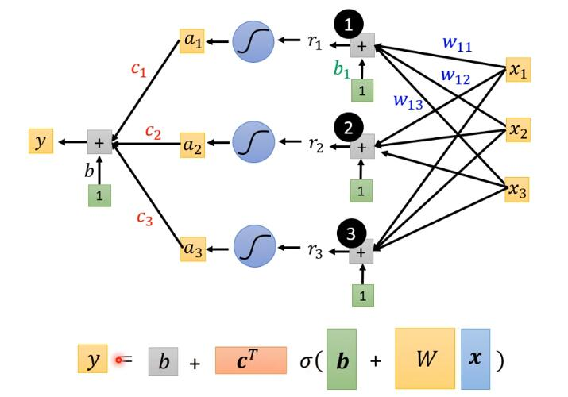

w的每一列/行提出来，和其他未知参数b、c的拼起来构成一个长向量

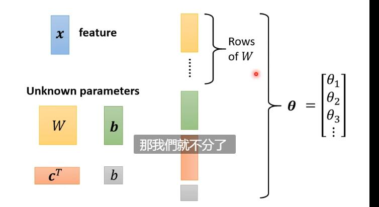

#### 第二步 Loss

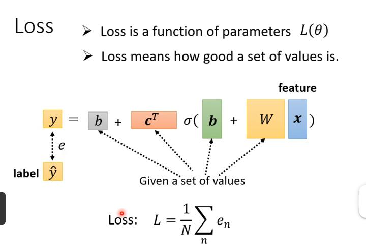

loss是误差和

#### 第三步 最优化 找出一组使Loss最小的θ

随机选θ0（横轴自变量），对每个θ计算微分，集合起来，得到向量g（gradient）

算好后更新

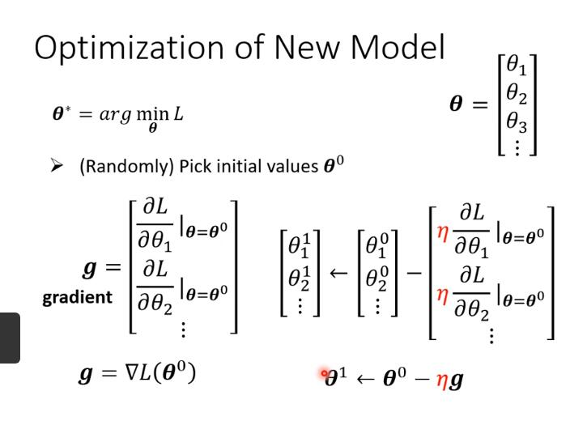

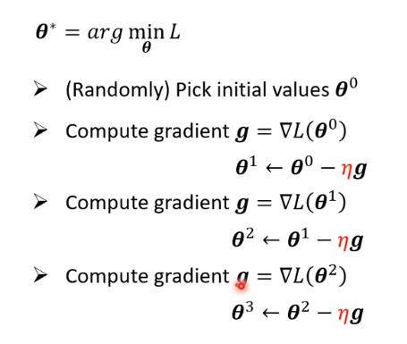

N表示所有资料，分成一个个batch，用每个B算出的L123来更新参数

更新参数**update**  

把所有的B看过一遍**epoch** 

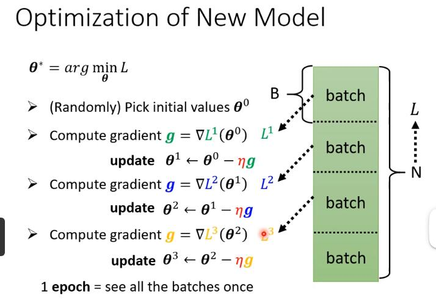

hyperparameter: batch size，sigmoid，η 自己定义的参数

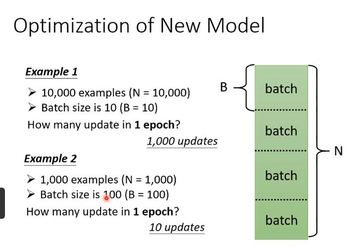

### ReLU-Rectified linear unit

直线+折线

max是选大的那一个

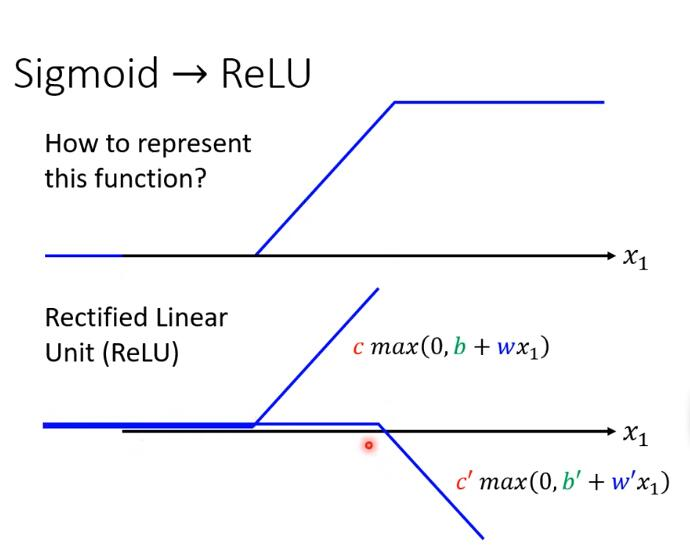

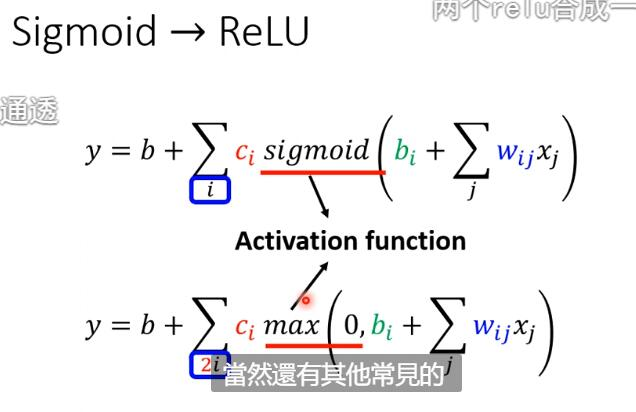

多层

举例：先用relu求出a，再用sigmoid求出a‘

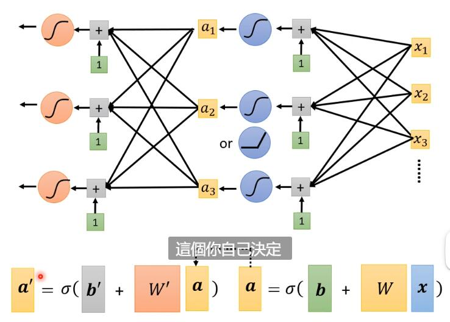

Neuron 神经元 Neural network 神经网络

Hidden layer  Deep learning

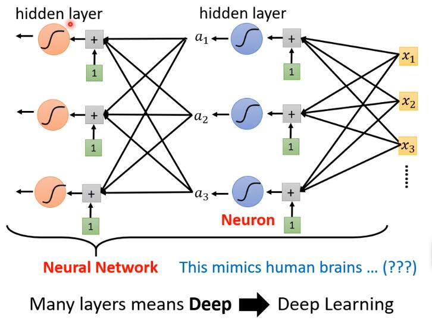

Overfitting过拟合

在训练资料上变好，在未知资料上的预测变差

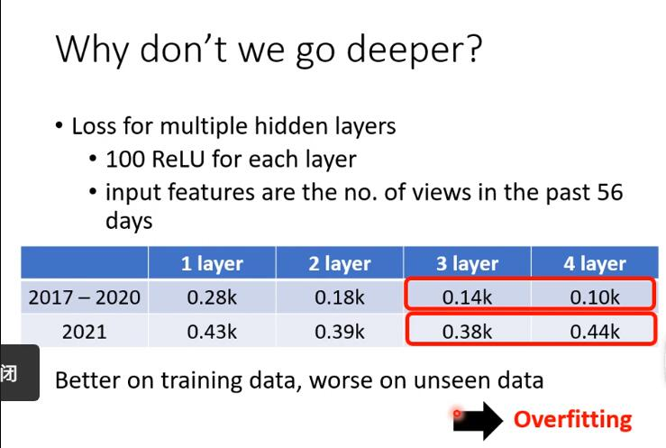