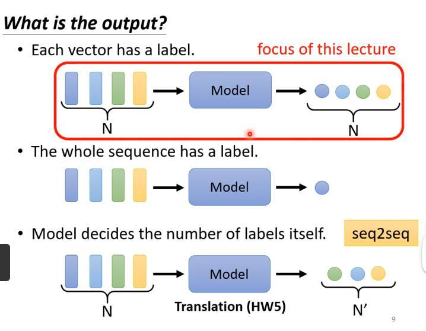
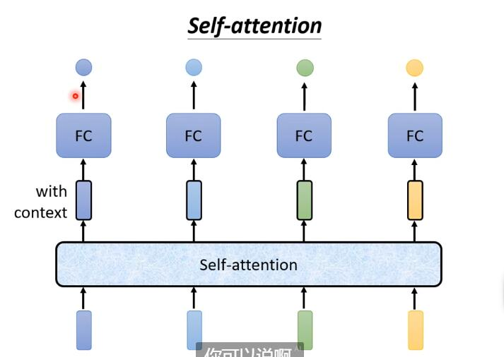

# 李宏毅机器学习

## 课程链接

1. 网课https://www.bilibili.com/video/BV1Wv411h7kN
2. 课件和资料Github汇总版：https://github.com/Fafa-DL/Lhy_Machine_Learning
3. 公众号【啥都会一点的研究生】课件资料：https://pan.baidu.com/s/1agZm-kXjF4aWH_4lRBv-Sg 

提取码：5b1w

[TOC]

## 第4节课-Self attention

### 处理的问题

#### 输入是一组向量，每次向量的数目可能不同

一般input是向量，输出可能是类别或数字。如果遇到输入是一组向量，每次数目也不一样怎么办？

比如文字输入，每个句子里的每个词汇都是一个向量，那么整个输入就是 Vector set

一个词汇表示为向量的方法可以是：

（1）one-hot encoding，开一个很长维度的向量，每一个维度表示一个词汇

（2）word embedding，相同类别的向量聚集在一起，一个句子是一排长度不一的向量

比如语音，一段声音序号是一排向量

取一个范围，也称为**window**，把window里的资讯描述为一个**frame**，也就是一个向量

通常一个frame长度25ms，每次移动10ms

#### 输出会是什么？

**（1）输入和输出的数目一样**

每个向量都有一个类别，比如输入四个向量，输出也是4个（数值、类别）

举例：词性标注

**（2）输出只有一个**

**（3）输出几个未知，由机器自己决定 sequence to sequence**

比如：翻译

### 以下基于Sequence Labeling（第一种）

考虑上下文：

（1）**设置window，包含几个向量**：把向量串起来，给fully connected network（后面用FC代替）一整个window的资讯

（2）**考虑整个input sequence:** Self attention

### Self attention

能做到：考虑整个sequence（后面用sq），并且输入几个vector，就输出几个vector‘（考虑整个sq的），然后把每个vector’分别丢进FC

交替使用

#### 知名文章推荐 Attention is all your need

#### 具体过程

input：一组vector，可能是整个network的input，可能是某个hidden layer处理后的output

**找相关：**首先根据a1找出这个sequence里面和它有关的其他向量

**数值表示相关度：**Dot-product

输入的两个向量分别乘不同的矩阵，得到q和k两个向量，再把q和k做点积（内积）

**Attention score**

自己和自己也需要计算关联性

根据α‘，可以得知哪些向量和a1最有关联，接下来：先用a1乘wv得到v1，然后用v1乘α‘1,1，通过这个方法分别计算a2，a3，a4，结果加起来得到b1

如果a1和a2关联性大，那么α’1,2就大，计算出的b1会更接近v2，所以哪个a的α‘越大，哪个v就会支配结果b

#### 矩阵运算表示

每一个ai都要乘上Wq这个矩阵得到qi，把a1到a4视为一列看作是一个矩阵I，q1到q4视为一列看作是一个矩阵Q，

通过矩阵的乘法可知，如图 I x Wq = Q；同理得到矩阵K、V

q1 x k1的转置 = α1,1（向量点积相当于看作矩阵转置后相乘）

https://www.bilibili.com/video/BV1Ss421T7dE 【线代理解】向量和矩阵的奇妙联系！

视为是矩阵和向量相乘，k1到k4看成矩阵的四行，乘上q1，得到列向量α1到α4

两个矩阵相乘

V与A‘的第一列相乘得到b1

**总结**：I表示self-attention的input，从I到O就是self-attention的过程

K的转置乘Q得到A，A的矩阵做处理得到A’（A'又称attention matrix）

只有Wq、Wk、Wv未知，需要学习，通过训练资料找出来

### Multi-head Self-attention

**Example： 2 heads**

有多个q，不同的q负责不同的相关性

a先乘一个矩阵得到qi（i代表位置），qi再乘上另外2个矩阵得到qi,1和qi,2；同理k、v

bi,1和bi,2接起来，乘上一个矩阵，得到bi

### Positional encoding

**问题**：每一个input出现在sequence的哪个位置，对self attention这一层而言是未知的

为每一个位置设计一个vector，称为positional vector  如图，每一列就是一个e

目的是让model处理input时知道在什么位置

#### 知名文章推荐 https://arxiv.org/abs/2003.09229

 比较和提出新的positional encoding

### Truncated self attention

处理语音的self attention

由于一段语音的sequence过长，导致需要L x L次的内积，L很大计算量大，不容易训练

处理方式：不看整个sequence，只看一个范围内的

### Self attention for image

把一张图片看成vector set

例如：一个解析度为5 x 10图片，视为大小为5 x 10 x 3的tensor，3代表3个channel，把每一个位置的pixel视为一个三维的向量，那么整张图片就是5 x 10个向量

#### 知名论文推荐 https://arxiv.org/abs/2005.12872

### Self attention 和 CNN 的比较

每个pixel产生一个 q（query），其他pixel产生 k（key），考虑整个图片的资讯

receptive field，只考虑field里面的资讯

#### 知名论文推荐 https://arxiv.org/abs/1911.03584

### Self attention 和 RNN 的比较

recurrent neural network

### Self attention for Graph

#### 减少self attention的计算量是未来重点

