# 李宏毅机器学习

## 课程链接

1. 网课https://www.bilibili.com/video/BV1Wv411h7kN
2. 课件和资料Github汇总版：https://github.com/Fafa-DL/Lhy_Machine_Learning
3. 公众号【啥都会一点的研究生】课件资料：https://pan.baidu.com/s/1agZm-kXjF4aWH_4lRBv-Sg 

提取码：5b1w

[TOC]

 

## 第二节课

### testing data loss结果不理想后的解决措施

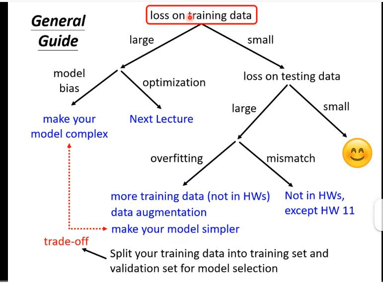

#### **Model bias**

函数复杂度不够表达想要的特征，无法达到理想的small loss

Solutions：比如增加更多的features（自变量）

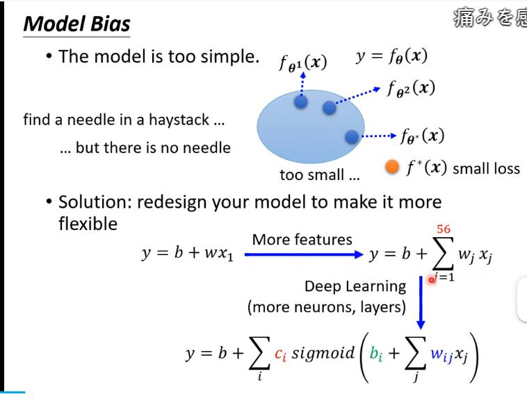

#### **Optimization**

local minima（找到极小值而不是最小值）

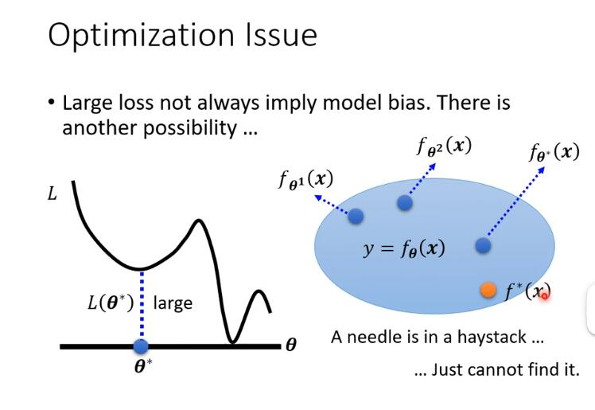

Solution：先用浅层的model找到一个最优的loss1，再用深层的，因为深层的弹性肯定比浅层的好，一定能做到loss1，如果出现深层的最优loss比loss1大，那会是深层model的optimization没有做好

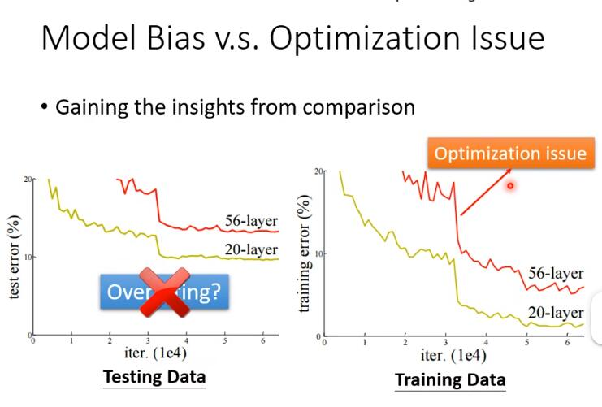

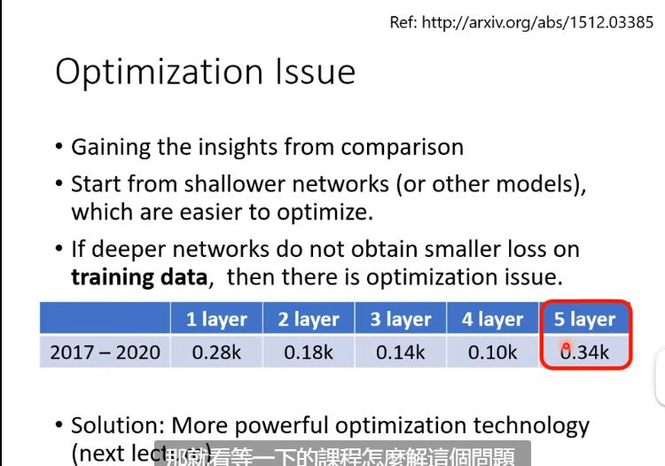

#### **Over-fitting**

training data loss 小， testing data loss 大

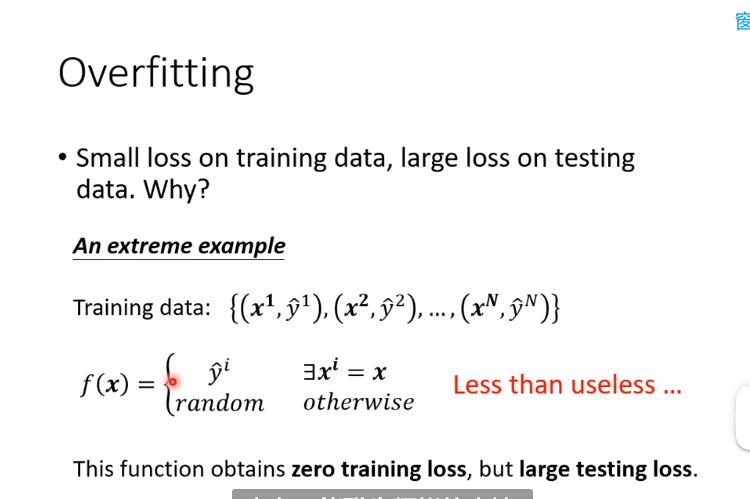

弹性较大的模型产生的问题：

Solution：增加训练数据、数据增强（自己创造数据，比如放大，翻转图片）、限制model的弹性

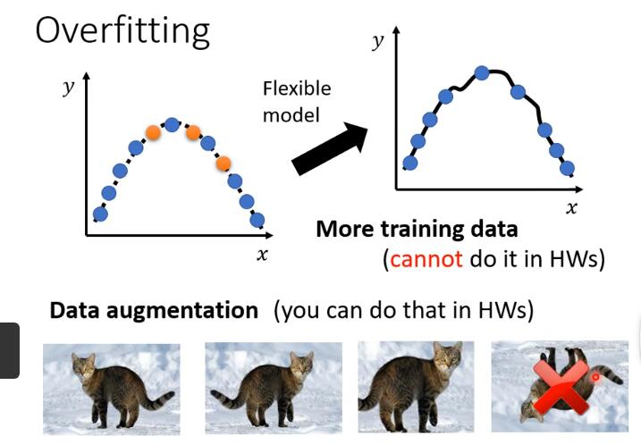

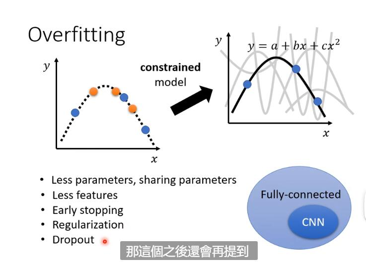

限制过大，就回到了model bias的问题

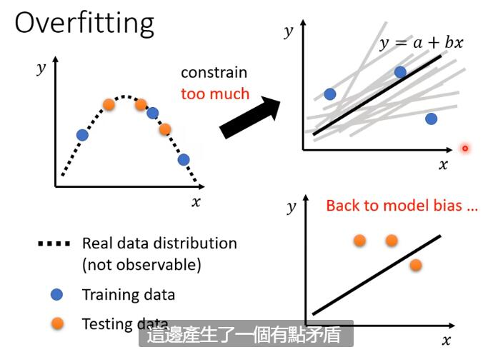

#### **那么如何选择好的model呢？**

不推荐把几个弹性不同的model用测试集测试，从中选一个好的结果

原因：测试集参与参数选择，导致结果有偏，不具有参考价值。所以引入validation set 验证集。

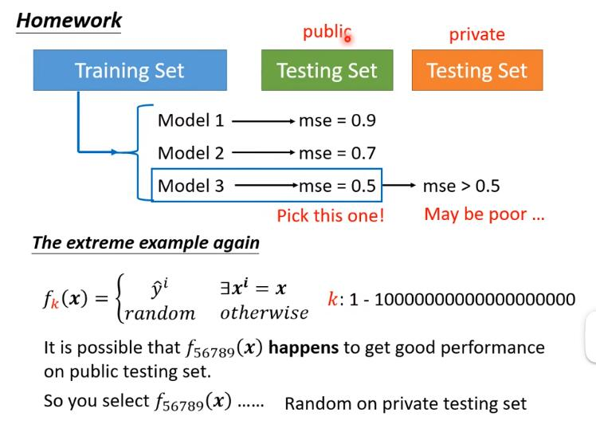

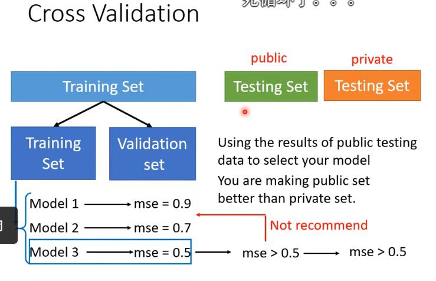

如何分数据，得到validation set？

**N折交叉验证**

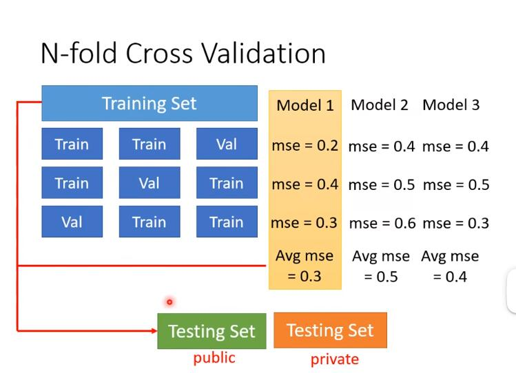

#### **Mismatch**

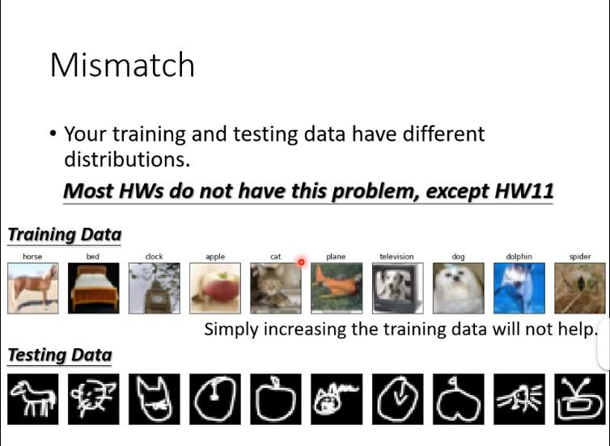

### Optimization fails

Gradient descent 梯度下降法

Local minima 局部最小值

Saddle point 鞍点，鞍点任意方向的梯度都为零，带入参数更新的公式，参数不会发生变化

Critical point 驻点，临界点

**如何鉴别是哪个点？**

局部最小值，周围的loss都比它大；鞍点周围有loss比它小的

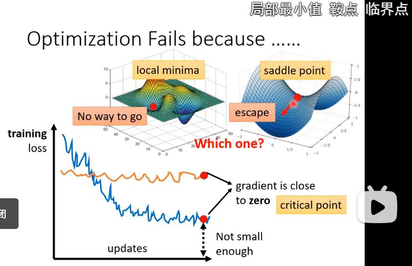

**泰勒展开**

泰勒级数近似估计

g是梯度，h是海森矩阵

具体课程见b站，涉及到高等数学，暂时无法解决

