## 第五章 Transformer

[TOC]

Sequence to sequence

output长度未知，由机器决定（例如，语音辨识文字、翻译）

### Encoder基本架构

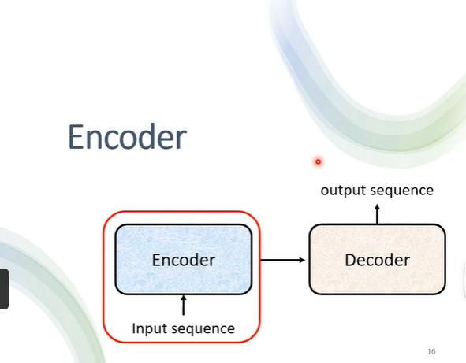

Encoder：给一排向量，输出另一排向量（可以用self-attention，cnn，rnn）

每一个block可能有好几个layer在工作

​                                                   

#### residual connection

在基于self-attention的基础上，将输出的vector加上input里的原vector，得到新的output；

再把新的到的output进行layer normalization（不是batch normalization）

#### layer normalization

**是对不同feature（特征、向量）的同一dimension（维）计算 mean（均值）、standard deviation（标准差）**。对于输入的每一层，将其均值和标准差计算出来，然后对每个输入特征进行归一化，使其均值为0，方差为1。这一过程是对每个样本的特征进行操作，而不是跨样本。

**而batch normalization是对同一个feature（向量、特征）里的不同维度计算**。

- 可以理解为一个矩阵里面的纵向和横向；

- 之前是多个样本的同一特征做正态化，这里是同一个样本的不同特征做正态化；

- batch norm是列标准化，layer norm是行标准化

由以上过程得到FC network的输入；

FC的output再经过一次residual connection得到的vector，再经过normalization，得到最终一个block的输出

由下图可知，block会重复n次

注释：Feed forward（FC network）、multi-head attention（self-attention）

#### 归一化的计算举例

##### 假设输入

设想我们有一个自注意力层的输出向量如下：

$$
\text{output} = \begin{bmatrix}
3.0 \\
-1.0 \\
2.0 \\
0.0 \\
1.0
\end{bmatrix}
$$

##### 步骤 1: 计算均值

首先，我们计算这个向量的均值（mean）：

$$
\text{mean} = \frac{3.0 + (-1.0) + 2.0 + 0.0 + 1.0}{5} = \frac{5.0}{5} = 1.0
$$

##### 步骤 2: 计算标准差

接下来，我们计算标准差（standard deviation）。首先计算每个元素与均值的差的平方的平均值，然后取平方根：

$$
\text{variance} = \frac{(3.0 - 1.0)^2 + (-1.0 - 1.0)^2 + (2.0 - 1.0)^2 + (0.0 - 1.0)^2 + (1.0 - 1.0)^2}{5}
$$

$$
= \frac{(2.0)^2 + (-2.0)^2 + (1.0)^2 + (-1.0)^2 + (0.0)^2}{5} = \frac{4.0 + 4.0 + 1.0 + 1.0 + 0.0}{5} = \frac{10.0}{5} = 2.0
$$

$$
\text{standard deviation} = \sqrt{2.0} \approx 1.4142
$$

##### 步骤 3: 归一化

现在，我们用均值和标准差对输出向量进行归一化。归一化的公式是：

$$
\text{normalized\_output}_i = \frac{\text{output}_i - \text{mean}}{\text{standard deviation}}
$$

我们逐个计算每个元素的归一化：

- 对于 \(3.0\):

$$
\text{normalized\_output}_1 = \frac{3.0 - 1.0}{1.4142} \approx \frac{2.0}{1.4142} \approx 1.4142
$$

- 对于 \(-1.0\):

$$
\text{normalized\_output}_2 = \frac{-1.0 - 1.0}{1.4142} \approx \frac{-2.0}{1.4142} \approx -1.4142
$$

- 对于 \(2.0\):

$$
\text{normalized\_output}_3 = \frac{2.0 - 1.0}{1.4142} \approx \frac{1.0}{1.4142} \approx 0.7071
$$

- 对于 \(0.0\):

$$
\text{normalized\_output}_4 = \frac{0.0 - 1.0}{1.4142} \approx \frac{-1.0}{1.4142} \approx -0.7071
$$

- 对于 \(1.0\):

$$
\text{normalized\_output}_5 = \frac{1.0 - 1.0}{1.4142} = \frac{0.0}{1.4142} = 0.0
$$

归一化后的输出向量为：

$$
\text{normalized\_output} = \begin{bmatrix}
1.4142 \\
-1.4142 \\
0.7071 \\
-0.7071 \\
0.0
\end{bmatrix}
$$

##### 步骤 4: 缩放与平移

$$
假设我们有可学习的参数 \gamma = 1.0 和 \beta = 0.0，我们将归一化后的输出应用缩放与平移：
$$

$$
\text{output\_final} = \gamma \cdot \text{normalized\_output} + \beta
$$

$$
由于 \gamma = 1.0 和 \beta = 0.0，我们得到：
$$

$$
\text{output\_final} = \begin{bmatrix}
1.4142 \\
-1.4142 \\
0.7071 \\
-0.7071 \\
0.0
\end{bmatrix}
$$

### Decoder

#### autoregressive自回归过程

（1）decoder吃到特殊的token：begin（使用one hot vector，其中一个维度是1，其它维是0来表示）；

（2）接下来decoder吐出一个向量，这个向量的长度和vocabulary的size一样（比如全部中文字符的数目）；

（3）在吐出这个向量之前，会经过softmax（做分类），然后产生的向量里的分数就是一个distribution（权值全部加起来总和是1），分数最高的对应的字就是最终的输出。

#### softmax的过程

在Transformer模型的Decoder部分，Softmax层的主要作用是将模型的输出转换为一个概率分布，通常用于生成文本或进行预测。以下是Softmax操作的详细说明和例子。

##### Softmax操作

Softmax函数将一个向量的元素转换为概率分布，公式如下：

$$
\text{softmax}(z_i) = \frac{e^{z_i}}{\sum_{j} e^{z_j}}
$$

$$
其中，\ z_i \ 是输入向量的第 \ i \ 个元素，\ j \ 是所有元素的索引。\\Softmax的输出将是一个与输入向量同样维度的概率分布，所有输出的和为1。
$$

##### 在Transformer Decoder中的作用

在Decoder中，Softmax通常应用于最后的线性层输出，这一层将Decoder的输出映射到词汇表的维度，以生成每个词的概率分布。

##### 举例说明

假设我们有一个Decoder的输出向量 \( z \)：

$$
z = \begin{bmatrix}
2.0 \\
1.0 \\
0.1
\end{bmatrix}
$$

我们要对这个向量应用Softmax。

##### 1. 计算指数

首先，计算每个元素的指数：
$$
\ e^{z_1} = e^{2.0} \approx 7.3891 \  \\  \ e^{z_2} = e^{1.0} \approx 2.7183 \  \\   \ e^{z_3} = e^{0.1} \approx 1.1052 \
$$
所以我们得到的指数向量为：
$$
e^z = \begin{bmatrix}
7.3891 \\
2.7183 \\
1.1052
\end{bmatrix}
$$

##### 2. 计算总和

接下来，计算这些指数的总和：

$$
\sum_{j} e^{z_j} = 7.3891 + 2.7183 + 1.1052 \approx 11.2126
$$

##### 3. 计算Softmax

现在，我们使用Softmax公式计算每个元素的概率：

- 对于 \( z_1 \):

$$
\text{softmax}(z_1) = \frac{e^{2.0}}{11.2126} \approx \frac{7.3891}{11.2126} \approx 0.6590
$$

- 对于 \( z_2 \):

$$
\text{softmax}(z_2) = \frac{e^{1.0}}{11.2126} \approx \frac{2.7183}{11.2126} \approx 0.2424
$$

- 对于 \( z_3 \):

$$
\text{softmax}(z_3) = \frac{e^{0.1}}{11.2126} \approx \frac{1.1052}{11.2126} \approx 0.0986
$$

##### 结果

经过Softmax处理后，我们得到的概率分布为：

$$
\text{softmax}(z) = \begin{bmatrix}
0.6590 \\
0.2424 \\
0.0986
\end{bmatrix}
$$

##### 总结

在这个例子中，Softmax将Decoder的输出向量转换为一个概率分布，表明模型对于词汇表中每个词的生成概率。这是文本生成的关键步骤，帮助模型选择下一个最可能的词。

接下来把**第一个输出**（案例为“机”，也是表示为one hot vector的形式）、**begin和encoder的输出**作为decoder新的input

再重复上述过程：**通过begin和“机”，得到一个蓝色的向量**，根据这个向量里面给每一个中文的字（维度）的分数，决定第二个输出是什么，这里是“器”。

#### 结构

如果遮住一部分，基本和encoder一样

#### **masked attention**

与self attention不同，生成b1时不看a2、a3、a4，只看a1；生成b2时不看a3、a4，只看a1、a2；

具体计算，就是把b2的q2与a1的k1、a2的k2去计算attention，然后只计算v1和v2的

 **END** （在输出的时候出现）

 准备特殊的符号，让机器输出停下来

#### Non-autoregressive (NAT)

一次产生一整个句子：输入一排begin，输出一排token

NAT跑得会比AT快

**如何控制NAT的输出？**

（1）再加一个分类的模型，根据输入，输出要输几个token，比如语音”机器学习“就要输出4

（2）给300个begin的token，假设现在输出句子的长度不会超过300个字，找end的位置，end右边的就当无效输出

### Encoder-Decoder间传递讯息

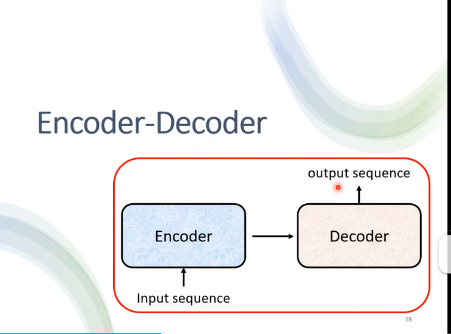

#### cross attention

encoder给予两个输入，decoder给予一个输入

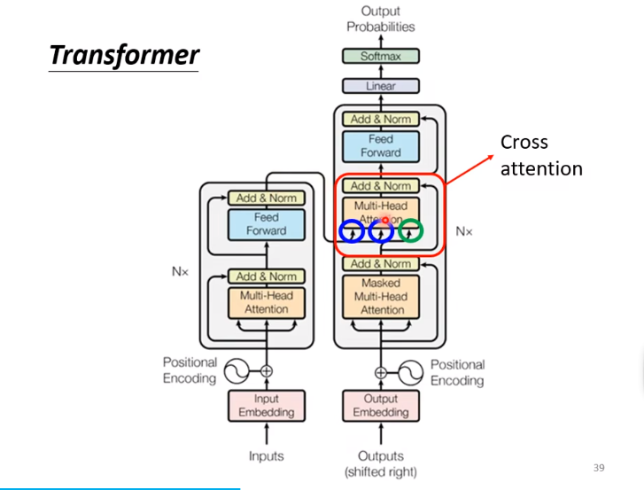

q来自decoder，k、v来自encoder

在这一步骤，这encoder、self attention（mask）都是给几个向量，就输出几个向量

α‘表示经过normalization

**过程：**给decoder输入begin，经过mask self-atttention，生成一个向量，这个向量乘上一个矩阵得到q；

encoder生成的a，分别乘上另一个矩阵得到k，k经过normalization得到α‘；a乘上第三个矩阵得到v，把几个α’乘上v的结果相加，得到FC的input

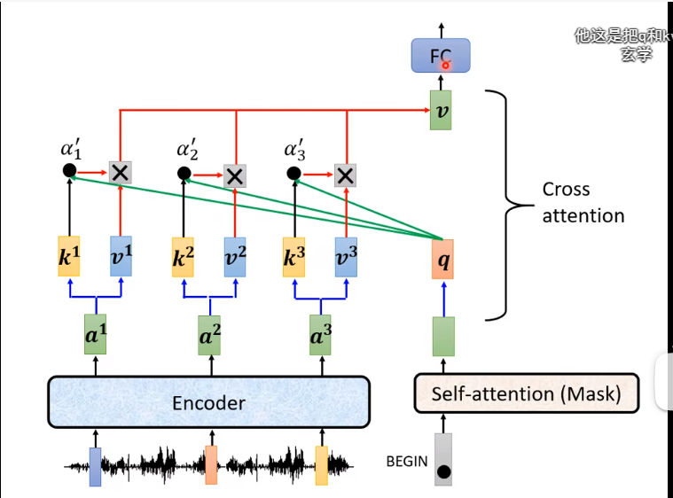

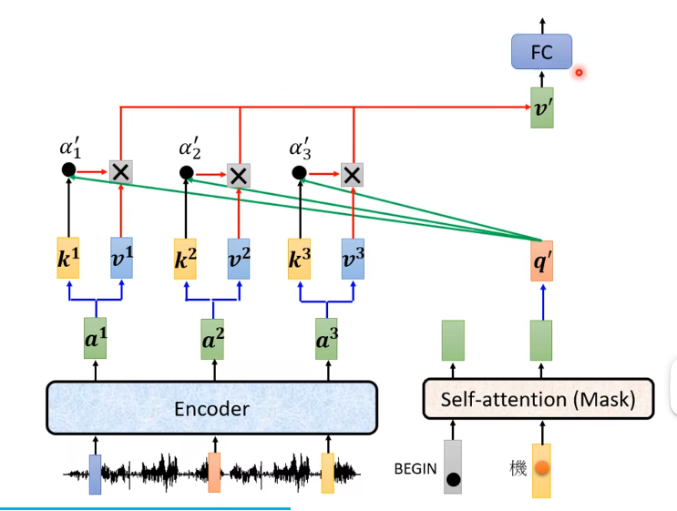

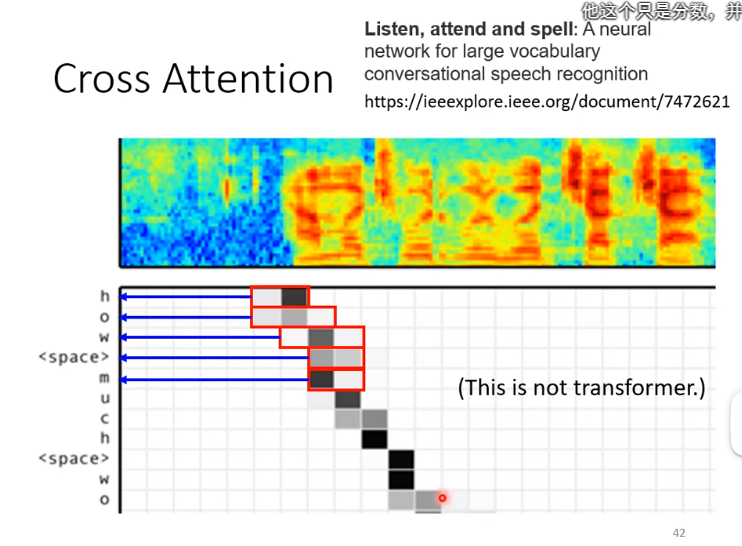

传统情况是decoder用的encoder的最后一层，但也有人用不同的情况

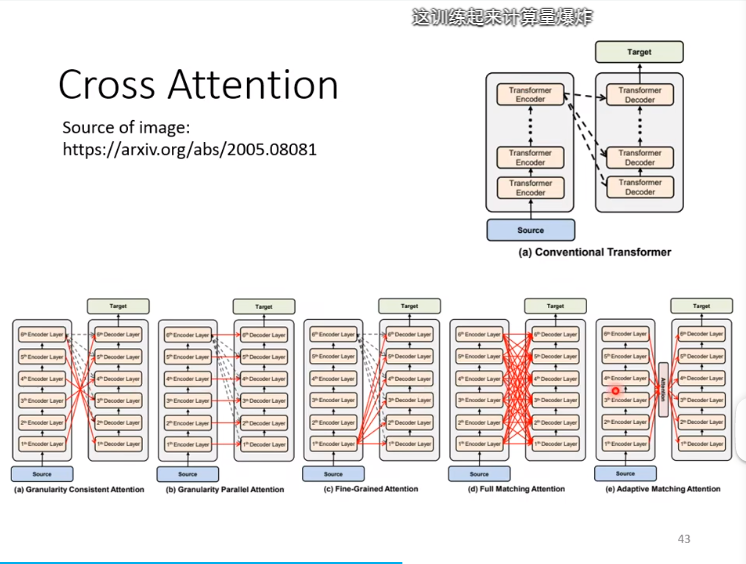

### Training

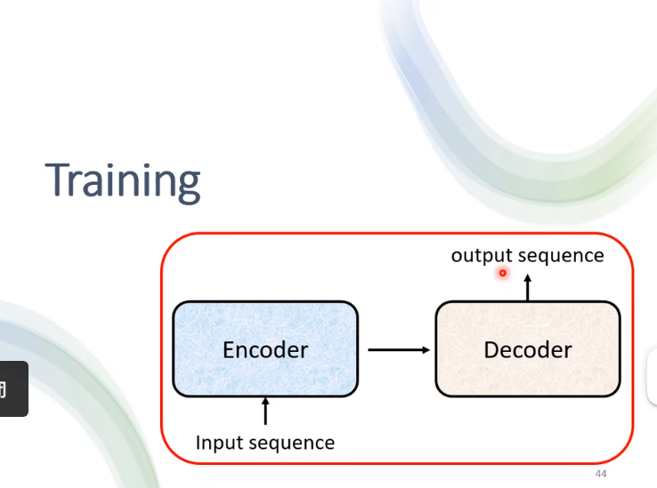

（之前都是test，和inference一个意思）

#### **cross entropy 交叉熵**

**ground truth**

ground truth可以是对应输入句子的正确翻译、摘要或其他形式的目标文本。模型在训练过程中会根据输入数据生成预测，然后与ground truth进行比较

**distribution**

decoder的输出是一个分布，我们希望这个分布和ground truth尽可能的接近。

因此计算distribution和ground truth的cross entropy，越小越好

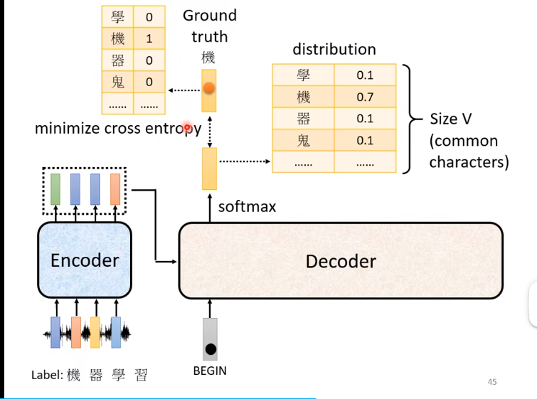

希望所有的cross entropy的总和最小，这里例子不止“机器学习”，还包括“END”，应该把最后一个与“END”计算cross entropy

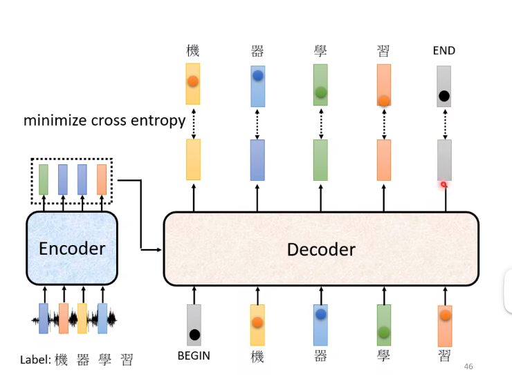

#### Teacher Forcing

在训练时，decoder的输入是ground truth

例如：

（1）在有begin和机时，输出器

（2）在有begin、机、器时，输出学

（3）在有begin、机、器、学，输出习

（4）在有begin、机、器、学、习，输出end

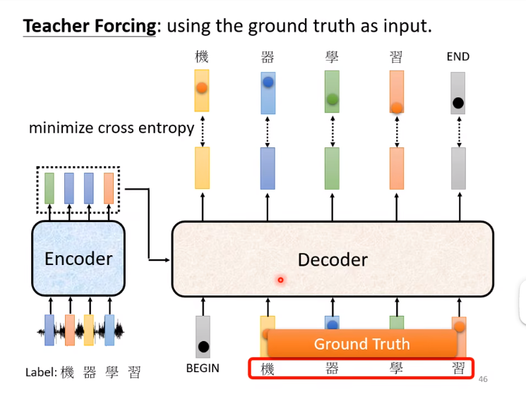

### TIPS

#### copy mechanism

chatbot

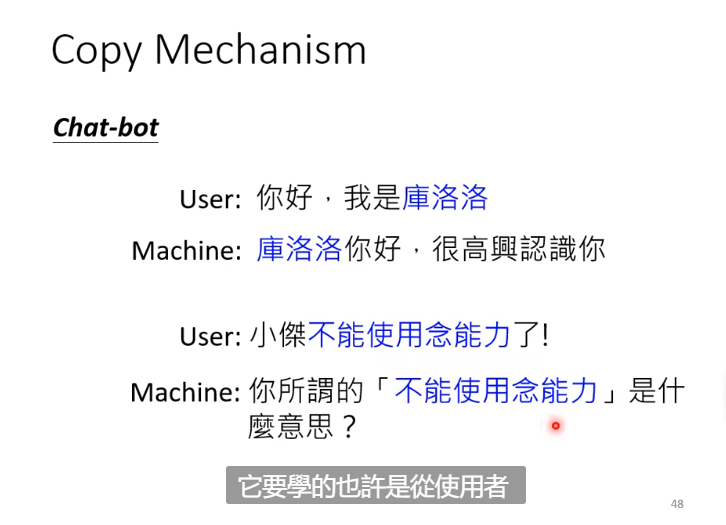

summarization 总结摘要

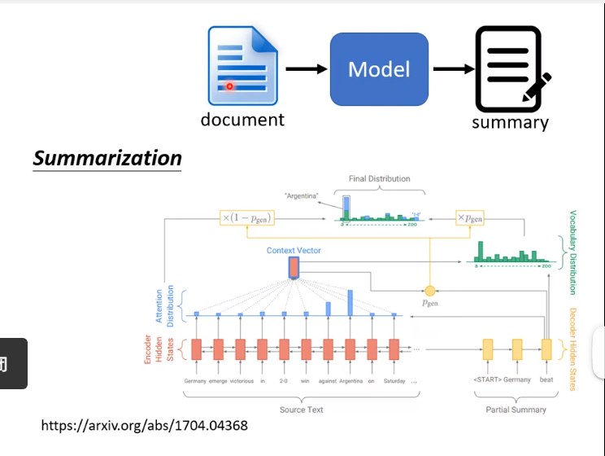

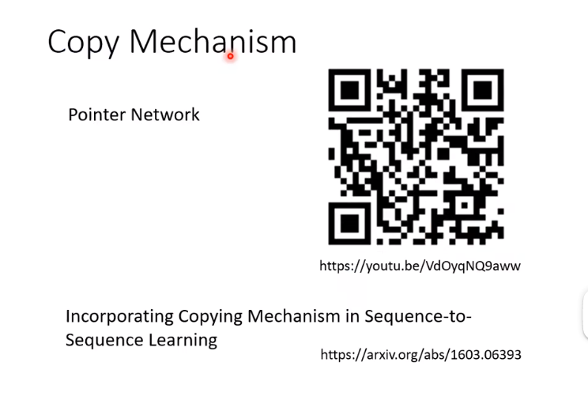

#### guided attention

机器在输入较长词组时没有问题，但是一个词汇时出现“漏字”

要求机器做attention有固定方式，比如在语音转文字时把全部内容都看一遍

如下图，机器做attention时顺序是颠三倒四的（下面一行），这样语音识别的结果就可能会有错误，使用guided attention让它固定顺序为从左到右（第一行）

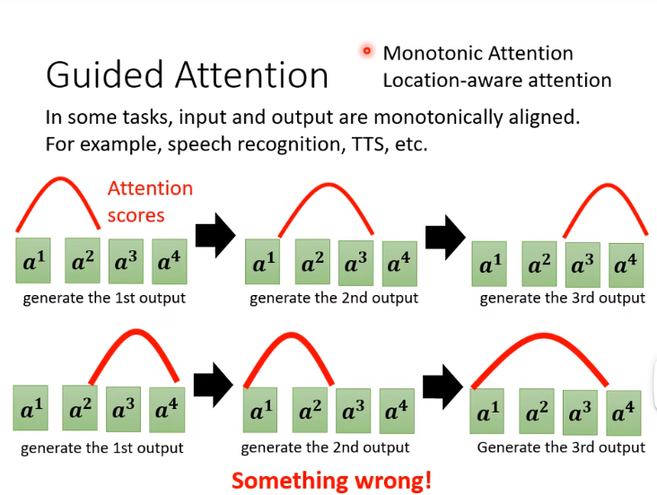

#### beam search波束搜索

 如果每次都选择分数较高的那个作为输出，称为**greedy decoding**

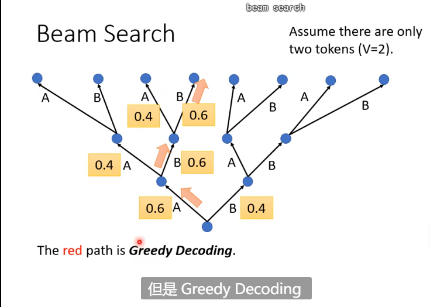

但是可能会出现下面的情况，虽然一开始第一个B的分数是0.4，但是它后面对应的输出出现了0.9

暴力搜索穷举很难，于是用beam search

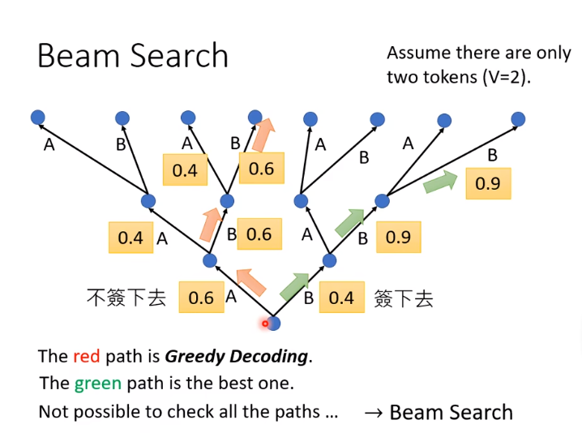

针对任务本身的特性，有时候使用beam searching也会效果不好。比如续写故事（等需要发挥创造力的工作），加一些随机性会比直接找分数最高的方式好。

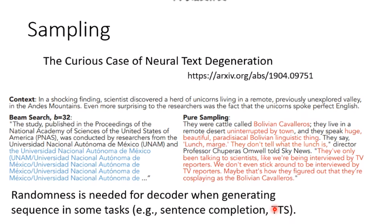

#### bleu score

产生完整的句子以后，和正确答案作比较。而在训练时，使用的是cross entropy。

但是minimize cross entropy，不一定会造成max bleu score

### **在optimization无法解决的问题，**使用RL硬train

比如无法optimize的loss function，把它当做是RL的reward，把decode当做是agent，可以尝试一下。

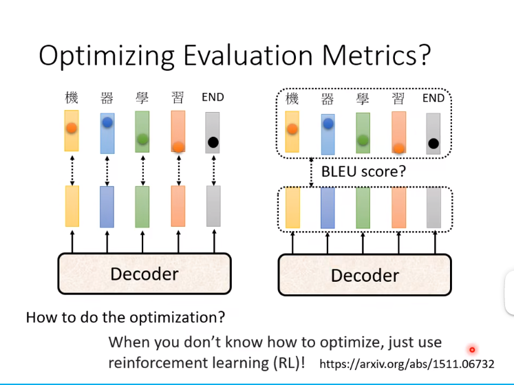

#### scheduled sampling

给decoder训练时输入一些错误的东西。如果train时只看正确的，那么test时可能会一步错步步错。

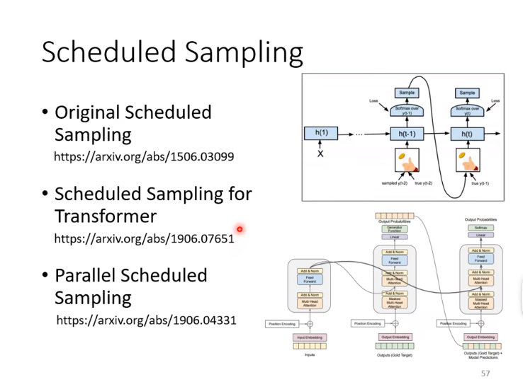
